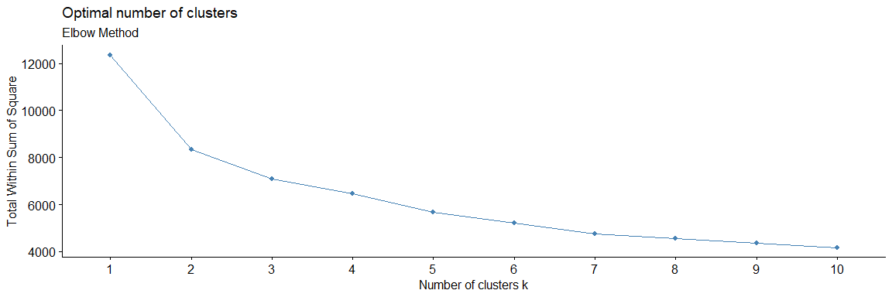
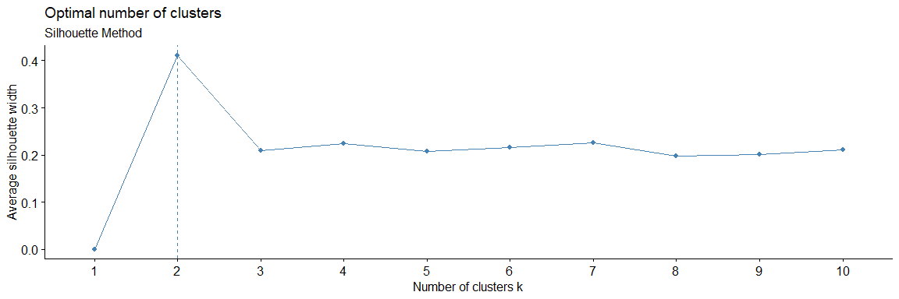
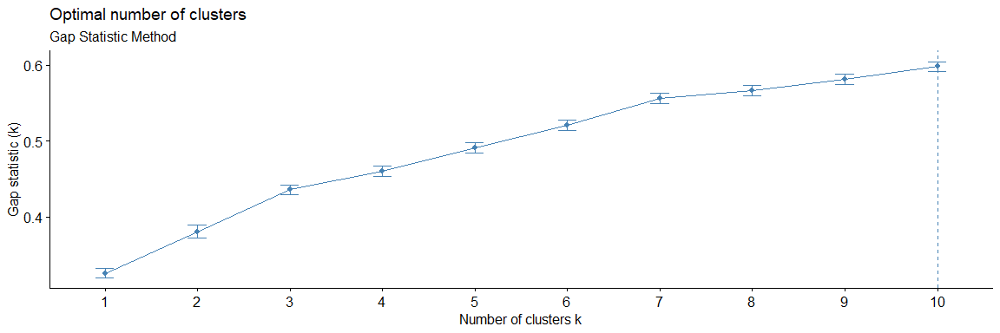

<style>
body {
text-align: justify}
</style>

```{r setup, include=FALSE}
knitr::opts_chunk$set(echo = TRUE,
                      message = FALSE,
                      warning = FALSE,
                      fig.width = 12,
                      fig.height = 4,
                      fig.align = "center")
library(rgl)
knitr::knit_hooks$set(webgl = hook_webgl)
```

# Pendahuluan

<i>Clustering</i> adalah salah satu teknik Machine Learning, yang memiliki kemampuan untuk mengelompokkan kumpulan data yang tidak berlabel. Setiap data yang tidak berlabel nantinya akan diklasifikasikan ke dalam kelompok tertentu dengan konsep, titik data yang berada dalam kelompok yang sama harus memiliki sifat atau fitur yang serupa, sedangkan titik data dalam kelompok yang berbeda harus memiliki sifat atau fitur yang sangat berbeda.

Dalam ilmu data, kita dapat menggunakan <i>clustering</i> untuk mendapatkan beberapa wawasan berharga dari data kita dengan melihat hasil pengelompokan yang terjadi. Wawasan yang berharga tersebut bisa kita bawa untuk membantu kita dalam menentukan segmentasi market, <i>social netwrok analysis</i>, dan masih banyak lagi. Di luar semua manfaat yang bisa kita dapatkan dari metode <i>clustering</i>, masih ada sebuah stigma yang menempel terhadap metode <i>clustering</i>. Pada artikel ini nantinya akan membahas metode <i>clustering</i> yang dapat digunakan untuk mengatasi stigma yang menempel terhadap metode <i>clustering</i>. 

## Stigma

Stigma yang menempel pada <i>clustering</i> adalah <i>clustering</i> hanya bisa digunakan untuk data-data numerik saja. Hal tersebut mungkin bisa terjadi dikarenakan, banyak sekali implementasi atau contoh dari <i>clustering</i> yang hanya menggunakan data numerik saja, sehingga munculah sebuah stigma tersebut.

Sesungguhnya <i>clustering</i> juga bisa digunakan terhadap data-data kategorikal, dan pada kesempatan kali ini kita akan mencoba menggunakan <i>clustering</i> untuk mengelompokan data kategorikal dan data numerik. Tipe algoritma yang akan kita gunakan nantinya bernama <b><i>Partitioning Around Medoids</b></i> dan metode perhitungan jarak yang akan digunakan adalah <i>Gower Distance</i>

## Partitioning Around Medoids (PAM)/K-Medoids

Algoritma Partitioning Around Medoids(PAM) atau bisa disebut K-Medoids adalah sebuah metode pengelompokan non-hierarki yang masih menjadi keluarga dekat dari metode K-Means. Metode PAM atau K-Medoids ini akan mengelompokan sekumpulan <i>n</i> objek menjadi ke beberapa <i>k</i> cluster. Jika metode pengelompokannya seperti itu, apa bedanya dengan metode K-Means kalau begitu? Perbedaanya terdapat pada bagaimana melakukan pengelompokannya.

Pada metode K-Means, penentuan sebuah objek masuk ke sebuah <i>cluster</i> tertentu berdasarkan perhitungan rata-rata jarak ecluidean. Sedangkan cara kerja metode K-Medoids akan diawali dengan penentuan Medoids (sebuah objek yang letaknya terpusat di dalam suatu cluster). Dari gambar di bawah, kita dapat melihat bagaimana perbedaan antara metode K-Means & K-Medoids dalam menentukan sebuah objek lebih sesuai untuk masuk ke sebuah cluster tertentu.  

```{r}
knitr::include_graphics("image/k-means-and-k-medoids.png")
```

Penentuan Medoids itu tidak dilakukan hanya sekali, melainkan berulang sampai Medoids itu tidak bisa bergerak lagi. Mengapa tidak hanya sekali, dikarenakan peletakan Medoids belum tentu posisi paling optimal. Untuk mendapatkan posisi yang paling optimal nantinya posisi Medoids awal akan dihitung ulang total simpangannya dengan menggunakan rumus berikut di bawah ini.

$$
S = b - a  
$$
Dimana:   

* <b>a</b> adalah jumlah jarak terdekat antara objek ke medoid awal
* <b>b</b> adalah jumlah jarak terdekat antara objek ke medoid baru

> Jika S < 0, maka tukar obyek dengan data untuk membentuk sekumpulan k baru sebagai Medoid

Langkah tersebut akan terus diulang sampai nantinya <b>S > 0</b>, yang berarti tidak adanya pergerakan lagi dari Medoid yang dipilih sebagai titik tengah. Dari titik Medoids yang paling optimum itu, akan dicari lagi objek yang menyerupai dari karakteristik Medoids tersebut. Supaya lebih terbayang dengan cara kerja dari metode PAM, kita bisa melihat visualisasi di bawah ini.

```{r}
knitr::include_graphics("image/K-Medoids_Clustering.gif")
```

Untuk lebih memahami bagaimana cara kerja PAM, mari kita coba untuk melakukan pengelompokan dengan metode tersebut.

# Library 

```{r}
# Data Wrangling
library(tidyverse)
library(Hmisc)

# Machine Learning
## Clustering 
library(cluster)
library(factoextra)

## Clustering Visualization
library(Rtsne)
library(rgl)

## Knit
library(knitr)
library(rgl)
```

# Explorasi Data

## Data

Data yang akan digunakan di sini adalah data yang berasal dari [kaggle](https://www.kaggle.com/shivam2503/diamonds). 

```{r, message=FALSE, warning=FALSE}
diamond <- read.csv("data/diamond.csv", 
                    stringsAsFactors = T)

head(diamond)
```

Data yang akan kita gunakan adalah data karakteristik berlian yang baru saja selesai diolah, dari data tersebut nantinya akan coba kita kelompokan untuk membuat beberapa segmentasi produk dari setiap berlian tersebut.

Berikut penjelasan mengenai kolom-kolom untuk data yang kita gunakan:
* `carat`: Berat dari berliannya 
* `cut`: Kualitas dari potongan berliannya (Fair < Good < Very Good < Premium < Ideal)
* `color`: Kualitas warna dari berlian tersebut (J < I < H < G < F < E < D)
* `clarity`: Seberapa jernih berlian tersebut  (I1 < SI2 < SI1 < VS2 < VS1 < VVS2 < VVS1 < IF)
* `depth`: Persentase dari kedalaman berlian tersebut
* `table`: Lebar maksimal dari atas berlian 
* `x`: Panjang dalam mm
* `y`: Lebar dalam mm
* `z`: Tinggi dalam mm

## Pendalaman datanya

Supaya kita lebih mengenal data yang kita miliki, kita bisa menggunakan fungsi `summary()` untuk melihat ringkasan dari data yang kita miliki berdasarkan tipe datanya. Untuk data dengan tipe kategorikal, fungsi `summary()` akan menghitung jumlah kemunculan setiap <i>unique value</i> dan untuk data dengan tipe numerik akan dihitung statistikanya.

```{r}
summary(diamond)
```

Dikarenakan hasil fungsi `summary()` untuk kolom `clarity` masih ada yang dikelompokan sebagai <i>other</i>, kita bisa akan coba analisis lebih lanjut proporsinya dengan menggunakan fungsi `table()`.

```{r}
table(diamond$clarity)
```

Dari hasil yang ditampilkan, kita bisa menarik kesimpulan bahwa, 

* Mayoritas dari hasil berlian yang sudah diolah memiliki potongan dengan hasil menengah ke eatas karena didominasi dengan hasil potongan dengan kategori <i>very good</i> sampai <i>ideal</i>.
* Kualitas warna yang dihasilkan juga bisa dibilang cukup merata walaupun lebih condong dengan kualitas warna yang bisa dikategorikan menengah ke bawah.
* Kejernihan dari batu berlian yang sudah diolah memiliki kejernihan dengan kualitas menengah ke bawah, karena hasilnya paling banyak didominasi dengan kategori <i>SI2</i> sampai <i>VS1</i>.
* Ukuran berlian yang sudah diolah memiliki panjang dan lebar dengan rentan dari 3.7 mm sampai 7.1 mm, sedangkan untuk tingginya memiliki rentan 2.2 mm sampai 4.3 mm.

Sebagai tambahan untuk data dengan tipe numerik kita bisa melakukan visualiasi dengan plot histogram untuk melihat jumlah observasinya.

```{r}
diamond %>% 
  select(carat, depth, table, x, y, z) %>% 
  hist.data.frame()
```

Dari hasil visualisasi histogram plot, kita bisa menarik kesimpulan bahwa, masing-masing numerik variabel memiliki rentan yang cukup variatif dan jumlah observasinya juga tidak merata.

* Jumlah kadar karat paling banyak dari data kita adalah 0.7 karat.
* Persentase kedalaman berlian, paling banyak berada disekitaran 60-65%.
* Lebar maksimal dari berlian kita paling banyak berada disekitaran 55-60.
* Dari hasil berlian yang sudah diolah paling banyak memiliki panjang dan lebar dengan rentan 5.7 - 5.9 mm.
* Dari hasil berlian yang sudah diolah paling banyak memiliki tinggir dengan rentan 3.5 - 3.7 mm.

# Implementasi PAM/K-Medoids

Setelah berkenalan dengan data yang kita gunakan, mari kita coba implementasikan metode PAM untuk membuat segmentasi produk berlian. Secara garis besar akan ada 3 langkah yang nantinya akan dilakukan, yaitu:

* Perhitungan jarak antar observasi data
* Penentuan jumlah <i>cluster</i>
* <i>Clustering</i>

## Langkah 1: Perhitungan Jarak 

Dari hasil eksplorasi data, kita mengetahui bahwa total observasi data kita adalah 10,000 baris dan setiap observasi data pastinya memiliki nilai yang berbeda. Agar nantinya hasil dari setiap kelompok terdiri dari data-data yang identik, kita harus mengetahui jarak antara satu observasi dengan observasi lainnya berdekatan atau tidak.

Pilihan paling populer untuk menghitung jarak adalah <i>Euclidean</i>, namun metode tersebut hanya berlaku untuk data numerik saja, oleh karena itu metode <i>Euclidean</i> tidak berlaku di sini. Ada satu metode yang dapat kita gunakan untuk kasus yang memiliki data campuran (data numerik dan data kategorikal), metode tersebut dinamakan <i><b>Gower Distance</i></b>.

Metode <i>Gower Distance</i> nantinya akan melakukan perbandingan pada setiap observasi data yang ada terhadap data-data yang lainnya, dengan cara melakukan perhitungan skala antara kedua observasi yang dibandingkan dengan rentan 0 sampai 1. Jika hasil dari perbandingannya <b>mendekati 0</b> maka bisa dibilang kedua data tersebut identik atau jarak antara kedua observasi tersebut berdekatan, begitu juga sebaliknya, jika rentan perbandingannya <b>mendekati 1</b> bisa dibilang kedua data tersebut tidak identik atau jarak antara kedua observasi tersebut berjauhan.

Supaya lebih terbayang bagaimana hasil dari metode <i>Gower Distance</i>, mari kita coba implementasikan ke data kita. Di R, metode <i>Gower Distance</i> tersimpan pada `library(cluster)` dan fungsi yang bisa digunakan adalah `daisy()`. Pada fungsi tersebut nantinya akan ada 2 parameter yang bisa diisi, yaitu:

* `x`: Data frame yang ingin digunakan
* `metric`: Metode apa yang ingin digunakan, karena kita akan menggunakan metode <i>Gower Distance</i>, kita bisa isi dengan <i>"gower"</i>.

```{r, message=FALSE, warning=FALSE}
diamond_gower <- daisy(x = diamond,
                       metric = "gower")
```

Sebagai pembuktian apakah metode <i>Gower Distance</i> memang bisa menempatkan data-data kita berdasarkan kemiripannya, kita bisa mencetak pasangan yang paling mirip dan berbeda dalam data kita dengan menggunakan fungsi di bawah ini.

* <i>Contoh pasangan data yang paling identik</i>

```{r}
example <- as.matrix(diamond_gower)

diamond[which(example == min(example[example != min(example)]),
        arr.ind = TRUE)[1, ], ]
```
Dari hasil pasangan data di atas, kita bisa melihat bahwa memang data observasi ke 952 dan 951 itu sangat identik, perbedaan yang terdapat pada kedua data di atas adalah panjang dan lebar dari hasil berlian yang diolah dan perbedaan hanya 0.01.

* <i>Contoh pasangan data yang paling identik</i>

```{r}
diamond[which(example == max(example[example != max(example)]),
        arr.ind = TRUE)[1, ], ]
```

Dari hasil pasangan data di atas, kita bisa melihat bahwa memang data observasi ke 660 dan 22 itu sangat tidak identik, perbedaan yang terdapat pada kedua data di atas terdapat pada semua kolom, bahkan nilai yang terdapat pada setiap kolomnya hampir tidak ada yang mendekati.

## Langkah 2: Penentuan Nilai Cluster(Kelompok)

Seperti yang sudah disampaikan pada bagian pendahuluan, tujuan dari melakukan <i>clustering</i> adalah menempatkan setiap observasi data yang ada ke beberapa kelompok yang sesuai dengan karakteristiknya atau bedasarkan kedekatan jarak antar setiap observasi. Pada langkah pertama kita sudah memiliki informasi jarak antar setiap observasi, kita akan memanfaatkan informasi tersebut untuk menentukan berapakah kelompok yang paling optimal. Hasil dari jumlah kelompok nantinya akan digunakan untuk menentukan berapa banyak segmentasi produk yang bisa dibuat berdasarkan data hasil olahan berlian.

Terdapat 3 metode yang dapat digunakan untuk menentukan jumlah kelompok yang paling optimum yaitu, <i>Elbow Method, Silhouette Method & Gap Statistic Method</i>. Ketiga metode tersebut dapat kita gunakan dengan menggunakan fungsi `fviz_nbclust()` dari `library(factoextra)`. Pada fungsi tersebut nantinya akan ada 3 parameter yang bisa diisi, yaitu:

* `x` = Data frame yang ingin digunakan
* `FUNcluster` = Metode pengelompokan apa yang ingin digunakan, karena kita akan menggunakan metode <i>PAM</i>, kita bisa isi dengan <i>pam</i>.
* `method` = Metode apa yang ingin digunakan untuk mengestimasi jumlah kelompok yang paling optimal. 

* <i><b>Elbow Method</i></b>

Dengan metode pertama ini kita akan memvariasikan jumlah kelompok dengan menghitung <i>Within Sum of Square</i> (WSS). WSS adalah akan menghasilkan jumlah kuadrat jarak antara setiap observasi terhadap titik Medoids untuk setiap kemungkinan jumlah kelompok, fungsi `fviz_nbclust()` secara otomatis akan menghitung WCSS sampai dengan 10 kelompok (jumlah kelompok yang ingin dicoba hitung bisa diatur secara manual sesuai dengan kebutuhan). 

Dengan bertambahnya jumlah kelompok, nilai WSS akan mulai berkurang (nilai WSS terbesar ketika K = 1). Ketika kita menganalisis grafik kita dapat melihat bahwa grafik akan berubah dengan cepat pada suatu titik dan dengan demikian menciptakan bentuk siku. Dari titik ini, grafik mulai bergerak hampir sejajar dengan sumbu X. Nilai K yang sesuai dengan titik ini adalah nilai K optimal atau jumlah kelompok yang optimal.

```{r}
# set.seed(123)
# 
# fviz_nbclust(x = as.matrix(diamond_gower),
#              FUNcluster = pam,
#              method = "wss") +
#   labs(subtitle = "Elbow Method")
```

```{r, echo = FALSE}

```

Dari plot di atas dapat dilihat bahwa 2 adalah jumlah kelompok yang optimum. Karena setelah k=2, penambahan jumlah kelompok tidak mengakibatkan penurunan jumlah nilai WSS yang signifikan.

Cara lain untuk mengetahui nilai kelompok yang optimum adalah dengan memilih jumlah kelompok pada area yang membuat bentuk seperti lekukan siku manusia, namun metode ini dapat dikatakan sebagai metode bias karena pendapat setiap orang mungkin berbeda.

* <i><b>Silhouette Method</i></b>

Metode kedua yang akan dicoba untuk menentukan jumlah kelompok yang optimal adalah <i>Silhouette Method</i>. Metode ini akan menghitung seberapa mirip sebuah observasi dengan kelompoknya sendiri jika dibandingkan dengan nilai kelompok lainnya. Hasil dari perhitungannya akan memiliki rentan koefisien dari <i>-1 sampai 1</i>. Jika nanti hasilnya makin mendekati 1 maka observasi tersebut cocok dengan kelompoknya dan kurang cocok dengan kelompok tetangga, begitu juga sebaliknya, jika hasilnya makin mendekati -1 maka observasi tersebut tidak cocok dengan kelompoknya akan tetapi lebih cocok dengan kelompok tetangganya.

Berbeda dengan <i>elbow method</i>, makin bertambahnya jumlah kelompok, nilai hasil perhitungan metode <i>silhouette method</i> tidak pasti akan berkurang. Penentuan nilai kelompok yang optimal akan ditentukan berdasarkan nilai koefisien paling tinggi pada saat membagi keseluruhan observasi ke berapa banyak kelompok. 

```{r}
# set.seed(123)
# 
# fviz_nbclust(x = as.matrix(diamond_gower),
#              FUNcluster = pam,
#              method = "silhouette") +
#   labs(subtitle = "Silhouette Method")
```

```{r, echo = FALSE}

```

Dari plot dapat dilihat bahwa 2 adalah jumlah kelompok optimum, karena setelah k=2 nilai koefisiennya mulai berkurang.

* <i><b>Gap Statistic Method</i></b> 
 
Metode terakhir yang akan digunakan adalah <i>Gap Statistic Method</i>, metode ini akan menghitung seberapa berbeda total variansi antara setiap observasi pada sebuah kelompok terhadap observasi yang terdapat pada kelompok lainnya. 

Jika dilihat dari plot di bawah ini, nilai kelompok optimum adalah 10.
 
```{r}
# set.seed(123)
# 
# fviz_nbclust(x = as.matrix(diamond_gower),
#              FUNcluster = pam,
#              method = "gap_stat") +
#   labs(subtitle = "Gap Statistic Method")
```
 
```{r, echo = FALSE}

```
 
Berdasarkan ketiga metode di atas, dua dari tiga metode menunjukkan bahwa k = 2 adalah jumlah kelompok yang optimal. Jadi, hasil dari berlian yang sudah diolah akan dibagi menjadi 2 kelompok.

<i>Disclaimer</i> : Penentuan jumlah kelompok tidak wajib menggunakan 3 metode pengujian di atas, penentuan kelompok juga dapat ditentukan berdasarkan pertanyaan bisnis atau kesepakatan bersama.
 
## <i>Clustering</i>

Setelah mengetahui jumlah kelompok yang optimal, sekarang kita bisa memulai tahapan terakhir yaitu mengelompokan semua data berlian ke dua kelompok dengan menggunakan fungsi `pam()`. Pada fungsi tersebut nantinya akan ada 2 parameter yang bisa diisi, yaitu:

* `x` = Data frame yang ingin digunakan
* `k` = Jumlah kelompok 

```{r}
pam_fit <- pam(x = diamond_gower, 
               k = 2)
```

Fungsi di atas akan membantu kita untuk mengelompokan keseluruhan observasi data ke dua kelompok berdasarkan kemiripan setiap observasi terhadap titik pusat atau <i>medoids</i>. Supaya kita bisa mendapatkan intuisi awal bagaimana karakteristik olahan berlian untuk setiap kelompoknya, kita bisa melihat dari tabel di bawah ini.

```{r}
diamond[pam_fit$medoids, ]
```

Seperti yang sudah disampaikan, dengan melihat tabel di atas kita hanya bisa mendapatkan intuisi awal bagaimana karakteristik dari masing-masing kelompok yang dibuat. Supaya kita dapat melakukan interpretasi lebih detail dan melihat apakah pengelompokan yang kita lakukan sudah dapat memisahkan setiap observasi data dengan baik, kita bisa memanfaatkan metode statistik deskriptif dan visualisasi.

###  Metode Statistik Deskriptif

Tujuan melakukan statistik deskriptif adalah untuk memahami karakteristik masing-masing kelompok, dan dalam kasus ini untuk mengetahui karakteristik untuk setiap segmentasi produk hasil olahan berlian.

```{r}
pam_results <- diamond %>%
  mutate(cluster = pam_fit$clustering) %>%
  group_by(cluster) %>%
  do(the_summary = summary(.))
```

* <b>Kelompok 1</b>

```{r}
pam_results$the_summary[[1]]
```

Jika dilihat dari hasil di atas, kita bisa menarik kesimpulan bahwa hasil olahan berlian untuk kelompok 1 memiliki karakteristik:

* Dari sudut pandang kualitas, hasil olahan berlian kelompok 1 didominasi dengan kualitas potongan yang sangat baik akan tetapi untuk kualitas warna dan kejernihannya kurang baik.
* Dari sudut pandang ukuran, ukuran berlian yang sudah diolah memiliki panjang dan lebar dengan rentan dari 3.7 mm sampai 6.8 mm, sedangkan untuk tingginya memiliki rentan 2.2 mm sampai 4.1 mm.

* <b>Kelompok 2</b>

```{r}
pam_results$the_summary[[2]]
```

Jika dilihat dari hasil di atas, kita bisa menarik kesimpulan bahwa hasil olahan berlian untuk kelompok 2 memiliki karakteristik:

* Dari sudut pandang kualitas, hasil olahan berlian kelompok 2 memiliki kualitas potongan yang cukup baik, dengan kualitas warna menengah dan tingkat kejernihan yang cukup baik.
* Dari sudut pandang ukuran, ukuran berlian yang sudah diolah memiliki panjang dan lebar dengan rentan dari 3.7 mm sampai 6.8 mm, sedangkan untuk tingginya memiliki rentan 2.2 mm sampai 4.1 mm.

### Metode Visualisasi

Jika dengan menggunakan metode statistik deskriptif kita bisa memahami karakteristik dari masing-masing kelompok, metode visualisasi dapat membantu kita untuk menilai bagaimana hasil pengelompokan. Metode visualisasi yang akan digunakan adalah metode <i>t-SNE</i>, metode ini merupakan salah satu cara untuk memvisualisasikan data yang tidak hanya memiliki nilai numerik saja melainkan nilai kategorikal juga.

```{r}
set.seed(123)

tsne_obj <- Rtsne(X = diamond_gower, 
                  is_distance = TRUE)

tsne_data <- tsne_obj$Y %>%
  data.frame() %>%
  setNames(c("X", "Y")) %>%
  mutate(cluster = factor(pam_fit$clustering))

ggplot(aes(x = X, y = Y), data = tsne_data) +
  geom_point(aes(color = cluster)) +
  theme_bw()
```

Dari hasil plot di atas, kita bisa melihat bahwa setiap observasi sudah berhasil terbagi menjadi dua kelompok walaupun memang masih ada beberapa observasi yang tumpang tindih atau berdekatan pada sebuah kelompok yang didominasi oleh kelompok yang berlawanan.

Selain menampilkan hasil clusterin dengan menggunakan plot secara 2 dimensi, kita juga dapat menampilkan hasil clustering dengan menggunakan plot 3 dimensi.

```{r}
set.seed(123)

tsne_obj_3d <- Rtsne(X = diamond_gower, 
                  is_distance = TRUE,
                  dims = 3)

tsne_data_3d <- tsne_obj_3d$Y %>%
  data.frame() %>%
  setNames(c("X", "Y", "Z")) %>%
  mutate(cluster = factor(pam_fit$clustering))

plot3d(tsne_data_3d, 
       col=factor(pam_fit$clustering))
legend3d("topright", 
         legend = unique(pam_fit$clustering), 
         pch = 16, 
         col = unique(pam_fit$clustering), 
         cex=1, 
         inset=c(0.02))
```

# Kesimpulan

Di sini kita bisa menarik kesimpulan bahwa <i>unsupervised machine learning</i> bisa digunakan untuk melakukan pengelompokan tidak hanya untuk data numerikal saja melainkan bisa juga digunakan untuk data kategorikal. Walaupun memang ada beberapa pendekatan yang berbeda dalam melakukan pengelompokan terutama metode yang digunakan dalam melakukan perhitungan jarak antara setiap observasi data, akan tetapi secara alur kerja bisa dibilang tidak ada perbedaan sama sekali.

Dalam kasus ini, implementasi dari <i>unsupervised machine learning</i> sangat berguna untuk sebuah perusahaan berlian yang baru berdiri dalam menentukan segmentasi produk karena <i>unsupervised machine learning</i> akan membantu kita dalam menentukan jumlah segmentasi yang paling optimum dan akan mengelompokan setiap hasil olahan berlian ke setiap kelompok yang memiliki karakteristik yang sama. 

<i>Disclaimer</i>, metode <i>unsupervised machine learning</i> bukanlah jawaban mutlak ketika kita menghadapi data yang tidak berlabel atau ketika kita sedang mencari sebuah karakteristik yang sama dalam setiap observasi data kita. Jika memang dirasa kita tidak mendapatkan jawaban yang memuaskan dari metode <i>unsupervised machine learning</i>, setidaknya kita bisa memanfaatkan metode <i>unsupervised machine learning</i> sebagai intuisi awal dalam menghadapi permasalahan tersebut.

Happy Clustering!

<b> Referensi </b>

1. [Clustering datasets having both numerical and categorical variables](https://towardsdatascience.com/clustering-datasets-having-both-numerical-and-categorical-variables-ed91cdca0677)
2. [K-Medoids/Partitioning Around Medoids (PAM) — Non Hierarchical Clustering with R](https://medium.com/@tribinty/k-medoids-partitioning-around-medoids-pam-non-hierarchical-clustering-with-r-9d0af590bbc0)
3. [K-Means Cluster Analysis](K-means Cluster Analysis)
4. [t-SNE](https://lvdmaaten.github.io/tsne/)


